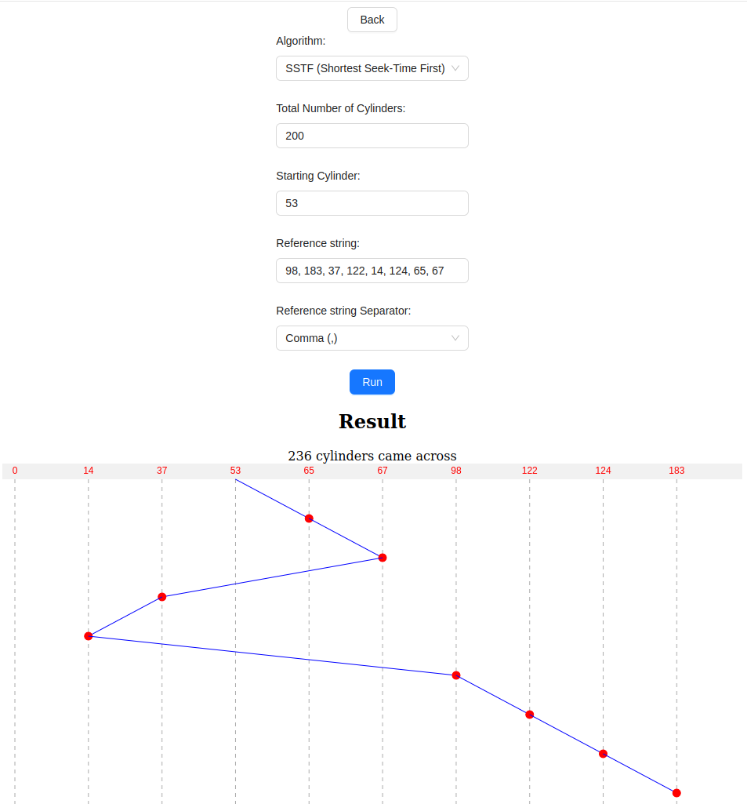
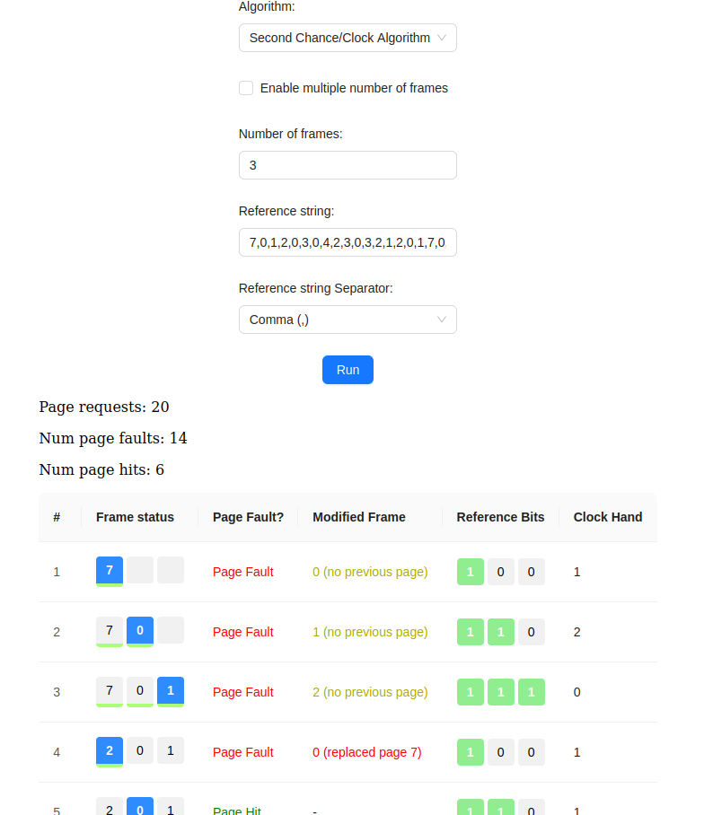
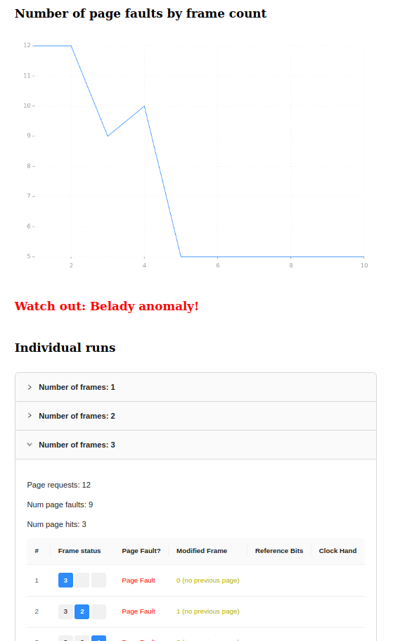
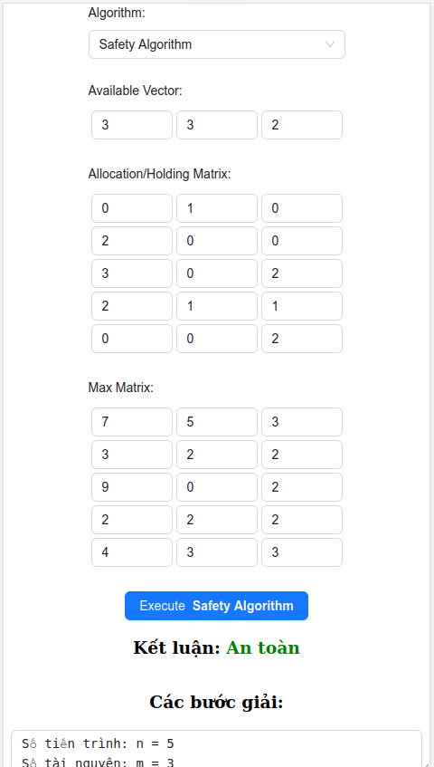
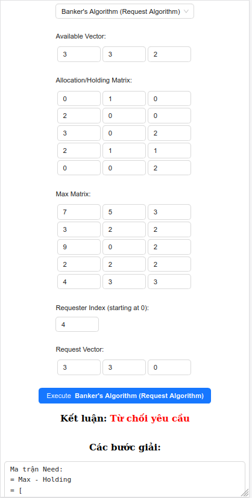
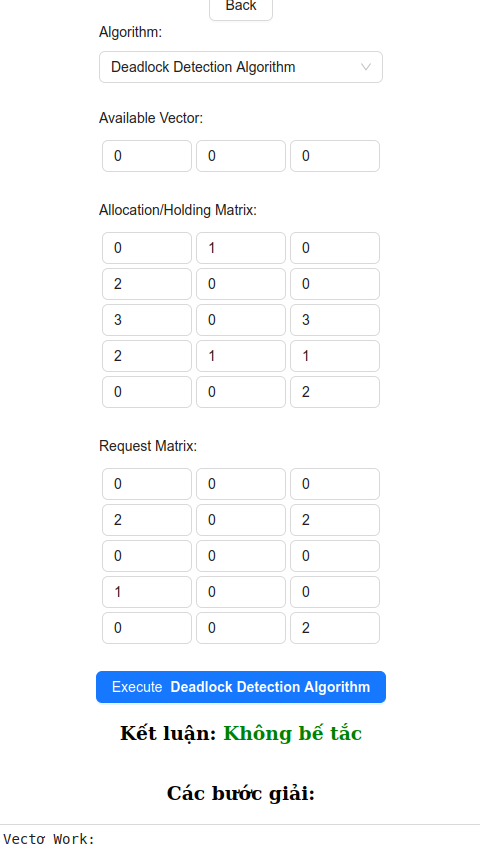
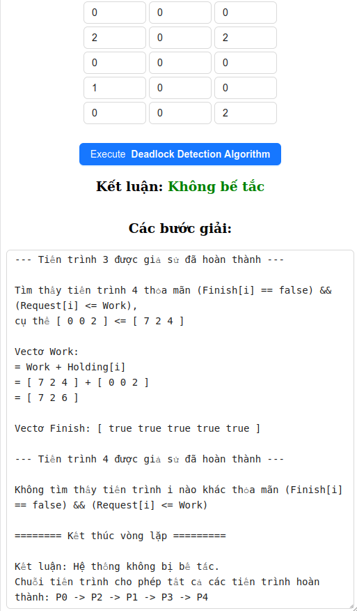

# OS Algorithms Implementation

- [OS Algorithms Implementation](#os-algorithms-implementation)
  - [HDD Scheduling Algorithms](#hdd-scheduling-algorithms)
  - [Page Replacement Algorithms](#page-replacement-algorithms)
    - [Example 1](#example-1)
    - [Example 2](#example-2)
  - [OS Resource Management Algorithms](#os-resource-management-algorithms)
    - [Algorithms](#algorithms)
    - [Preview](#preview)
      - [Safety Algorithm](#safety-algorithm)
      - [Banker Algorithm](#banker-algorithm)
      - [Deadlock-Detection Algorithm](#deadlock-detection-algorithm)
        - [Image 1](#image-1)
        - [Image 2](#image-2)
    - [How to Run](#how-to-run)
  - [Author](#author)

## HDD Scheduling Algorithms

1. FCFS
2. SSTF (see image below)
3. SCAN
4. C-SCAN
5. LOOK
6. C-LOOK



## Page Replacement Algorithms

1. FIFO
2. Optimal Algorithm
3. LRU
4. MRU
5. LFU
6. MFU
7. LFU then LRU
8. Second-chance Algorithm (Clock Algorithm).

### Example 1

- Second-chance (Clock) Algorithm
- 3 frames
- Reference string input `7,0,1,2,0,3,0,4,2,3,0,3,2,1,2,0,1,7,0,1`



### Example 2

- FIFO Algorithm
- 1-10 frames
- Reference string input `3 2 1 0 3 2 4 3 2 1 0 4`



## OS Resource Management Algorithms

### Algorithms

- Safety Algorithm
- Banker Algorithm (Requesting Algorithm)
- Deadlock-Detection Algorithm

### Preview

#### Safety Algorithm



#### Banker Algorithm



#### Deadlock-Detection Algorithm

##### Image 1



##### Image 2



### How to Run

```sh
yarn
yarn dev
yarn build
yarn preview
```

## Author

Vũ Tùng Lâm 22028235 UET
